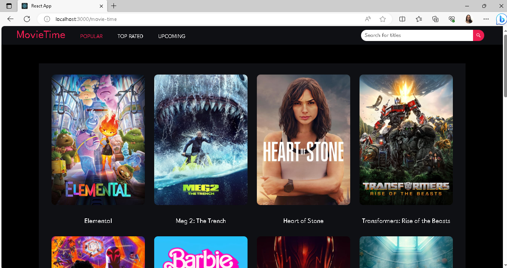
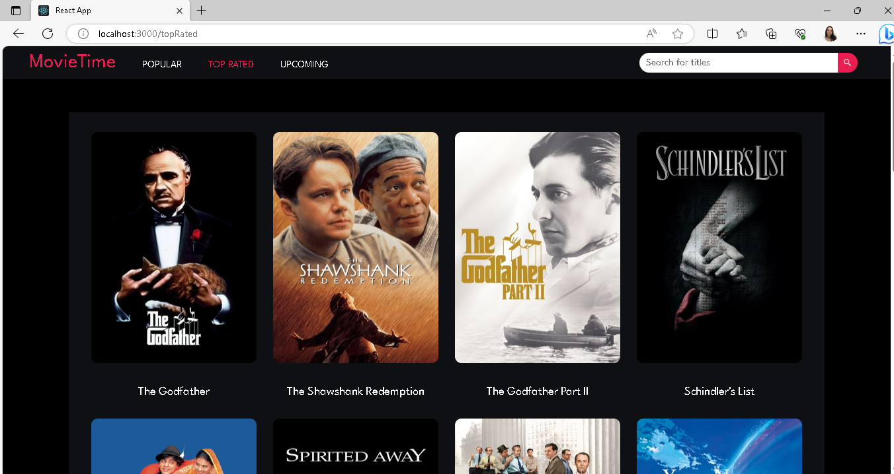
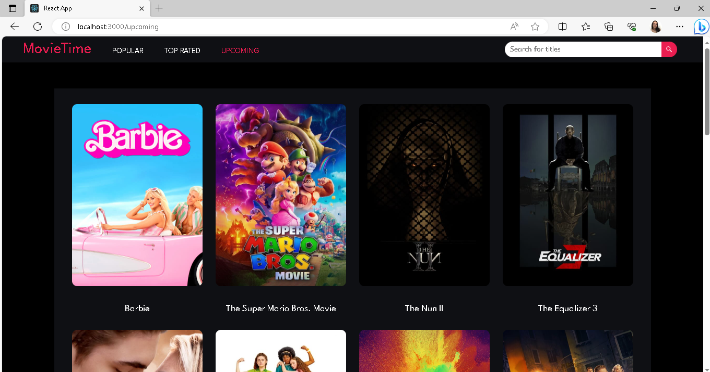
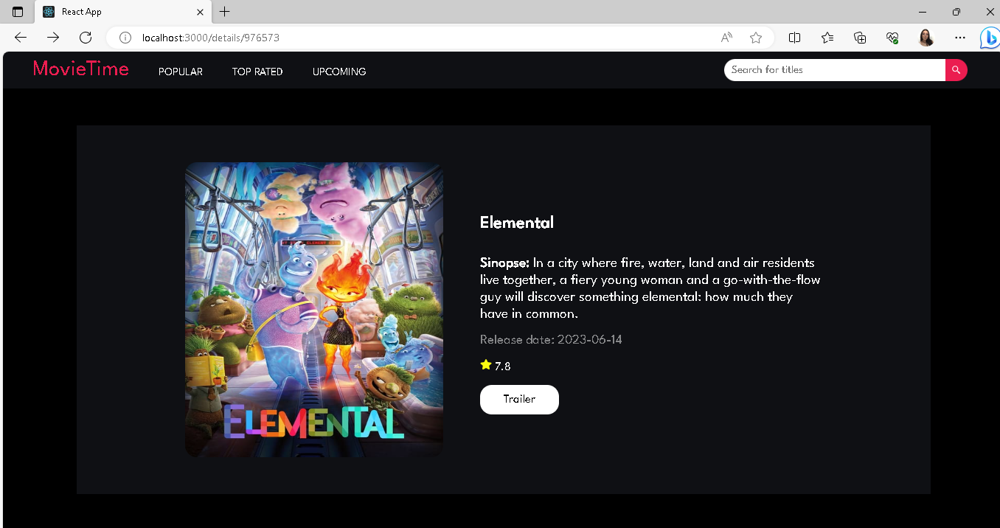
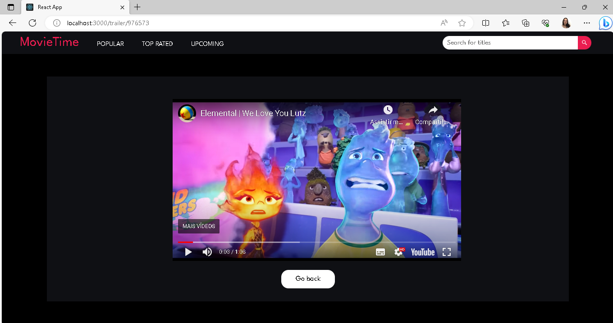
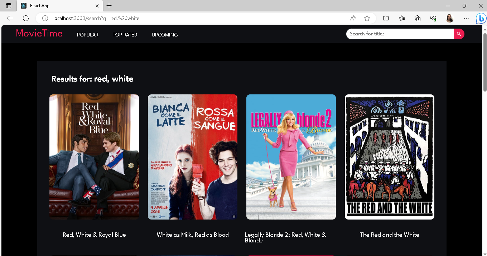

# Projeto Motie-Time
Site de filmes desenvolvido para prática de estudos

## Tecnologias utilizadas
- React
- JavaScript
- CSS
- API fetching através da API do TMDB

## Como rodar o projeto
Para instalar as dependências do projeto 
```
npm install
```
Para executar o projeto 
```
npm start
```
Agora o projeto estará disponível ```http://localhost:3000```

## Screenshosts

<p>






</p>